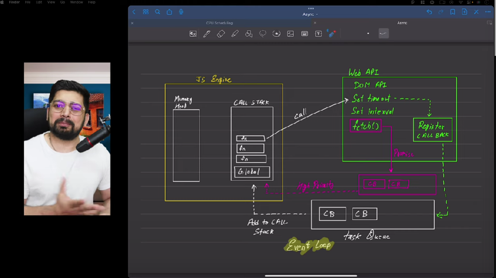

# Async

## Deafult Javascript -> 
1. Synchronous -> one code then one code ..
2. Single threaded -> all code executes only on one thread

## Execution Context

Execute one line of code at a time

Each operation waits for the last one to execute before executing.

|Blocking Code| NoN Blocking Code|
|-------------|-----------|
|Block the flow of program|Does not block execution|
|read file sync|read file async|

